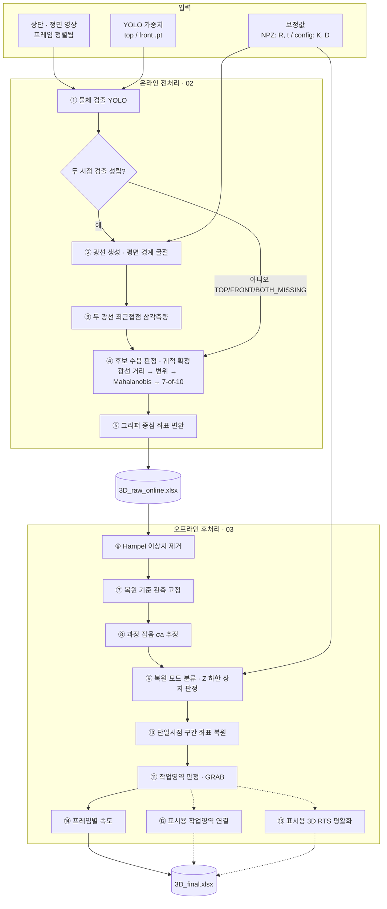

# 수중 그리퍼 물체 3D 추적 (상단 · 정면 2카메라)

상단 카메라와 정면 카메라 영상에서 YOLO로 물체를 검출하고, 수면·정면 벽의 굴절을 보정한 삼각측량으로
그리퍼 중심 기준 3D 좌표와 프레임별 속도를 구한다. 한쪽 카메라에서 물체가 가려진 구간은 남은 카메라의
굴절 광선과 비관측 축 추정으로 복원한다.

| 노트북 | 내용 | GPU | 실행 시점 | Colab |
|---|---|---|---|---|
| `01_calibration_npz` | 보정 NPZ 생성 (ArUco 마커 → R, t) | 불필요 | 카메라 위치를 바꿨을 때 1회 | [](https://colab.research.google.com/github/YOUR_ID/underwater-gripper-tracking/blob/main/notebooks/01_calibration_npz.ipynb) |
| `02_online_preprocess` | ①~⑤ 검출 · 삼각측량 · 게이트 → `3D_raw_online.xlsx` | **필요** | 실험마다 | [](https://colab.research.google.com/github/YOUR_ID/underwater-gripper-tracking/blob/main/notebooks/02_online_preprocess.ipynb) |
| `03_postprocess` | ⑥~⑭ 이상치 · 결측 복원 · GRAB · 속도 → `3D_final.xlsx` | 불필요 | 실험마다 | [](https://colab.research.google.com/github/YOUR_ID/underwater-gripper-tracking/blob/main/notebooks/03_postprocess.ipynb) |

> 저장소를 올린 뒤 이 파일과 세 노트북 0번 셀의 `YOUR_ID`(와 저장소 이름이 다르면 `underwater-gripper-tracking`)를 실제 값으로 바꾼다.

## 처리 흐름



점선은 최종 좌표·속도에 반영되지 않는 시각화 전용 경로다. 원본 다이어그램은 `docs/pipeline_diagram.drawio`
(diagrams.net에서 열기), 블록별 함수 · 변수 · 엑셀 열 이름은 [`docs/blocks.md`](docs/blocks.md)에 정리했다.

## 처음 사용할 때

### 1. Drive 데이터 폴더 준비

데이터는 GitHub에 올리지 않고 Google Drive에 둔다. 예시 구조:

```
MyDrive/8월연구/                 ← experiment.data_root
├── config.yaml                  ← 이 저장소의 config.yaml을 복사해 수정
├── 0812실험top/…/top5.MP4        ← 상단 영상
├── 0812fro/fro5.mp4              ← 정면 영상
├── manual_calib_top_0813.npz     ← 01이 만들고 02 · 03이 읽음
├── manual_calib_front_0813.npz
└── results/<experiment.name>/    ← 02 · 03의 결과가 자동으로 생김
```

다른 사람에게 넘길 때: 데이터 폴더를 공유(뷰어)하고, 받는 사람은 공유 폴더를 `내 드라이브`에
**바로가기 추가**한다. 결과는 쓰기 권한이 있어야 하므로 받는 사람은 `config.yaml`을 자기 드라이브에 복사하고,
`outputs.output_root`를 자기 드라이브의 절대경로(예: `/content/drive/MyDrive/my_results`)로 바꾼다.

### 2. 노트북 실행

1. 위 표의 Colab 배지를 누른다. (02는 `런타임 → 런타임 유형 변경 → T4 GPU`)
2. **0번 셀**: 저장소 받기, 라이브러리 설치, Drive 연결. Drive 접근 허용 창이 뜨면 허용한다.
3. **1번 셀**: `CONFIG_PATH`에 Drive의 config.yaml 경로를 넣고 실행한다. 파일이 없으면 템플릿을 그 위치에 복사하고 멈춘다.
   왼쪽 파일 패널에서 config.yaml을 더블클릭해 수정한 뒤 다시 실행한다.
   이 셀이 경로 존재 여부와 값의 범위를 점검하고, 문제가 있으면 고칠 항목을 알려준다.
4. 나머지 셀을 위에서부터 실행한다.

세 노트북은 같은 config.yaml을 읽으므로 값은 한 곳에서만 바꾼다. 실행할 때 실제로 쓴 값 전체가
결과 폴더의 `config_used.yaml`에 저장된다.

## 실험마다 바꾸는 값 (config.yaml)

| 등급 | 항목 | 내용 |
|---|---|---|
| **필수** | `experiment.name` | 결과 폴더 이름. 실험마다 다르게 |
| **필수** | `experiment.data_root` | 이 실험 데이터가 있는 Drive 폴더 |
| **필수** | `inputs.top_video`, `inputs.front_video` | 프레임 정렬된 두 영상 |
| **필수** | `water.surface_z_cm` | 바닥(ID0 마커 평면)으로부터 실제 물 높이 [cm] |
| 확인 | `inputs.calib_top_npz`, `inputs.calib_front_npz` | 카메라를 옮기지 않았으면 이전 NPZ 그대로 |
| 확인 | `sync.*_time_offset_sec` | 정렬된 영상이면 0 |
| 장비 변경 시 | `inputs.*_weights`, `models.target_class_names` | YOLO를 다시 학습했을 때 |
| 장비 변경 시 | `cameras.*` (K, dist, model) | 카메라를 바꿨을 때 (체커보드 재측정값) |
| 장비 변경 시 | `setup.motor_center_in_id0_cm` | 그리퍼(모터 중심) 위치가 바뀌었을 때 |
| 장비 변경 시 | `setup.front_wall_y_cm`, `setup.marker_size_cm`, `setup.front_wall_marker_*` | 수조 · 마커 변경 시 |
| 보정 NPZ | `calibration.*` | 01에서만 사용 (보정용 영상, 프레임 번호, 벽 마커 사용 여부) |
| 수정 금지 | `advanced` | 알고리즘 상수(`gtrack/settings.py`의 [C] 구역). 바꾸면 결과가 달라진다 |

## 결과 파일

| 파일 | 시트 / 내용 |
|---|---|
| `3D_raw_online.xlsx` | Trajectory(검출 · Meas · 상태) / Triangulation(ON/OFF 후보) / Online_Filter / Summary / Configuration |
| `3D_final.xlsx` | **Result**(분석용: 평활화 전 좌표 · 상태 · 속도) / Legend(열 설명) / Plot_Aux(그래프용 RTS 좌표) / Summary / Configuration / Debug |
| `analyzed_output.mp4` | 주석 영상 (선택) |
| `verify_unification.png` | 정면 화면에 world 마커 코너를 투영한 확인 이미지 |
| `config_used.yaml` | 실행에 쓴 값 전체 |

좌표 원점은 모터(그리퍼) 중심, 축 방향은 바닥 ID0 마커와 같다. 분석에는 Result 시트를 쓴다.

## 저장소 구조

```
config.yaml                     실험 설정 템플릿 (Drive에 복사해서 사용)
requirements.txt
notebooks/                      01 보정 NPZ · 02 전처리 · 03 후처리
gtrack/
  settings.py                   모든 상수 (원본 값) + config.yaml 적용 · 점검
  geometry.py                   ② 광선 생성 · Snell 굴절 (전처리 · 후처리 공용)
  io_utils.py
  calibration/
    core.py                     NPZ 계산 · 저장 (원본 manual_calib_*.py의 계산부)
    colab_click.py              Colab 안에서 코너 클릭 (확대경 포함)
  online/
    video_sync.py               입력 영상 열기 · 프레임 정렬
    calibration_io.py           NPZ + K, D → calib
    b01_detection.py            ① 물체 검출 + ◇ 두 시점 검출 성립?
    b02_rays.py                 ② (geometry.py 사용)
    b03_triangulation.py        ③
    b04_tracker.py              ④
    b05_motor_frame.py          ⑤
    visualize.py, raw_excel.py  주석 영상 · raw 엑셀 저장
    pipeline.py                 run_online()
  postprocess/
    inputs.py, geometry.py
    b06_hampel.py … b14_velocity.py   ⑥~⑭ (⑩은 reconstruction + hidden_axis_model 두 파일)
    final_excel.py              final 엑셀 시트 구성
    pipeline.py                 블록별 step 함수 + run_postprocess()
tools/local_gui/                로컬 PC에서 창으로 클릭하는 원본 보정 도구 (config.yaml 사용)
tests/                          후처리 회귀 테스트 (합성 데이터)
docs/                           블록별 변수 정리, 원본 다이어그램
```

## 자주 나는 오류

| 메시지 | 원인 · 조치 |
|---|---|
| `설정 점검 실패: … 경로가 존재하지 않습니다` | config.yaml 경로 오타, 또는 Drive 공유 폴더를 `내 드라이브`에 바로가기 추가하지 않음 |
| `… — 보정 NPZ 생성(notebooks/01)을 먼저 실행했는지 확인` | NPZ가 없음. 01을 실행하거나 이전 NPZ 경로를 지정 |
| `RAW_EXCEL … 전처리(notebooks/02)를 먼저 실행했는지 확인` | 03을 02보다 먼저 실행함 (같은 `experiment.name`이어야 함) |
| `입력 해상도 불일치` | 영상이 1920x1080이 아님. 원본 해상도 영상을 쓰거나 `video.expected_resolution` 확인 |
| `대상 클래스 확인 필요` | YOLO 모델의 클래스 이름이 `models.target_class_names`와 다름. 메시지에 모델 클래스 목록이 나옴 |
| `Wet mode requires valid dry-calibration NPZ` | NPZ 경로 오류 또는 R, t가 없는 파일 |
| 전처리가 매우 느림 | GPU 미설정 (02의 2번 셀 확인). 주석 영상을 끄면(`save_annotated_video: false`) 더 빨라짐 |
| 01에서 클릭 화면이 안 뜸 | 셀을 다시 실행. 계속 안 되면 `top.set_points([[u1,v1],…])`로 직접 입력하거나 `tools/local_gui/`를 로컬에서 실행 |
| `Drive mount` 실패 | 런타임 재시작 후 0번 셀부터 다시 실행 |

## 로컬 PC에서 실행 (선택)

```bash
pip install -r requirements.txt
python -c "from gtrack import settings; settings.configure('config.yaml'); \
from gtrack.postprocess.pipeline import run_postprocess; run_postprocess()"
```

config.yaml의 경로를 로컬 경로로 바꿔 쓴다. 보정 클릭은 `python tools/local_gui/manual_calib_top.py config.yaml`.

## 검증 · 원본 대비 변경

- 정리 전 원본(`online_preprocess_final_20260930.py`, `postprocess_final_20261001.py`, `manual_calib_*.py`)과
  계산 로직은 같다. 함수 본문을 그대로 옮기고 상수 참조만 `settings.이름`으로 바꿨다.
- 합성 데이터로 원본과 정리본의 출력 엑셀을 시트 단위로 비교해 모두 같음을 확인했다
  (전처리: 같은 FPS / 정면 30 fps + 시간 오프셋 두 조건, 후처리: 선형 보간 · Kalman episode · 말단 외삽 · GRAB · LOST 포함).
- 코드를 고친 뒤에는 `python tests/test_postprocess_regression.py`로 후처리 결과가 바뀌지 않았는지 확인한다.
- 변경 사항
  - 경로 · 물 높이 · 카메라 값은 코드 대신 config.yaml에서 관리한다. 결과는 `results/<experiment.name>/`에 저장한다.
  - 전처리와 후처리에 따로 있던 상수 · 열 이름표 · 광선/굴절 함수를 하나로 합쳤다 (값과 계산은 동일).
  - 전처리에서 호출되지 않던 함수 3개(`calibrate_from_video`, `triangulate_refractive`, 전처리용 `top_ray_plane_z`)를 뺐다.
  - 보정 NPZ 생성을 Colab용으로 바꿨다 (창 대신 브라우저 클릭). 저장 키는 원본 도구와 같다.
  - 코드 내부 열 이름과 엑셀 열 이름은 아직 다르다. 대응표는 `docs/blocks.md` 마지막 절.
- pandas 3.0에서는 원본 후처리 코드가 읽기 전용 배열 오류로 멈추므로 `pandas<3`으로 고정했다 (Colab 기본 pandas는 2.x).
