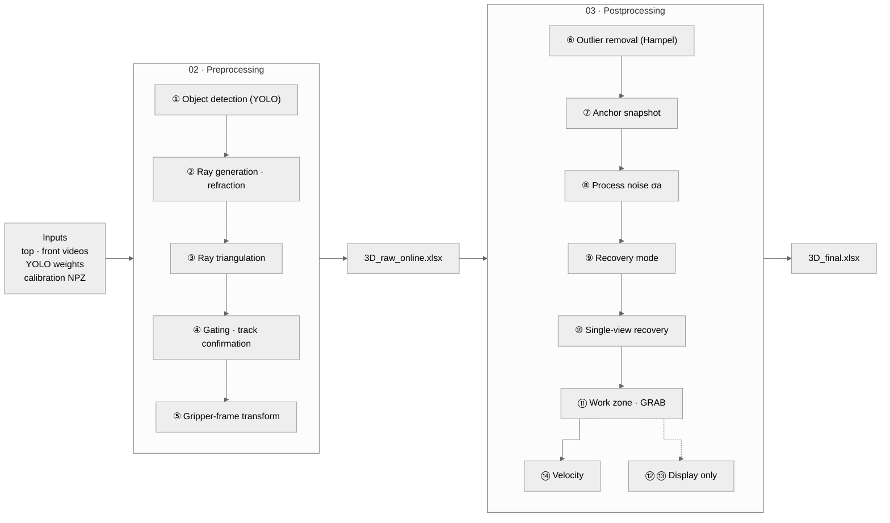

# Underwater Gripper Object 3D Tracking (Top + Front Cameras)

The object is detected with YOLO in the top and front camera videos and triangulated with refraction correction at the water surface and the front tank wall. The output is the 3D position relative to the gripper center and the frame-by-frame velocity. When the object is hidden from one camera, its position is recovered from the remaining camera's refracted ray and an estimate of the unobserved axis.

| Notebook | Purpose | GPU | When to run | Colab |
|---|---|---|---|---|
| `01_calibration` | Camera calibration NPZ from the ArUco marker (R, t) | No | Once after moving a camera | [](https://colab.research.google.com/github/dodokim777-boop/underwater-gripper-tracking/blob/main/workflow/01_calibration.ipynb) |
| `02_preprocessing` | Steps ①–⑤: detection, triangulation, gating → `3D_raw_online.xlsx` | Yes | Every experiment | [](https://colab.research.google.com/github/dodokim777-boop/underwater-gripper-tracking/blob/main/workflow/02_preprocessing.ipynb) |
| `03_postprocessing` | Steps ⑥–⑭: outlier removal, gap recovery, GRAB, velocity → `3D_final.xlsx` | No | Every experiment | [](https://colab.research.google.com/github/dodokim777-boop/underwater-gripper-tracking/blob/main/workflow/03_postprocessing.ipynb) |

## Pipeline



Steps ⑫ and ⑬ are for plotting only and do not affect the final position or velocity. Columns of each step are listed in [`reference/variables_by_step.md`](reference/variables_by_step.md).

## Before running

1. **Data on Google Drive.** Data is kept on Drive, not in this repository.

   ```
   MyDrive/files/                   ← experiment.data_root
   ├── experiment_settings.yaml     ← copy of this repository's experiment_settings.yaml
   ├── top/top5.MP4                 ← top video
   ├── front/front5.mp4             ← front video
   ├── manual_calib_top.npz         ← written by 01_calibration
   ├── manual_calib_front.npz
   └── results/<experiment.name>/   ← outputs of 02 and 03
   ```

2. **experiment_settings.yaml.** Fill in the required values (table below) once per setup. For each video set, change `experiment.name` and the two videos.
3. **Calibration NPZ.** Run `01_calibration` if the cameras were moved. Otherwise reuse the existing NPZ files.

## Running

1. Open a notebook from its Colab badge. `02_preprocessing` requires a GPU runtime (T4).
2. Cell 0 installs the dependencies and mounts Drive.
3. In cell 1, set `SETTINGS_PATH` to the experiment_settings.yaml on Drive. This cell checks file paths and value ranges before processing starts.
4. Run the remaining cells in order.

All notebooks read the same settings file. The values used in each run are saved as `config_used.yaml` in the results folder.

## Settings (experiment_settings.yaml)

| Level | Key | Description |
|---|---|---|
| **Required** | `experiment.name` | Results folder name |
| **Required** | `experiment.data_root` | Drive folder of this experiment |
| **Required** | `inputs.top_video`, `inputs.front_video` | Frame-aligned videos |
| **Required** | `water.surface_z_cm` | Water height above the floor (ID0 marker plane) [cm] |
| Check | `inputs.calib_top_npz`, `inputs.calib_front_npz` | Reuse the previous NPZ if the cameras did not move |
| Check | `sync.*_time_offset_sec` | 0 for frame-aligned videos |
| Equipment change | `inputs.*_weights`, `models.target_class_names` | After retraining YOLO |
| Equipment change | `cameras.*` (K, dist, model) | After replacing a camera (checkerboard intrinsics) |
| Equipment change | `setup.motor_center_in_id0_cm` | After moving the gripper (motor center) |
| Equipment change | `setup.front_wall_y_cm`, `setup.marker_size_cm`, `setup.front_wall_marker_*` | After changing the tank or markers |
| Calibration | `calibration.*` | Used by `01_calibration` only |
| Modify with caution | `advanced` | Algorithm constants (section [C] of `main_code/settings.py`). Changing them changes the results |

## Outputs

| File | Contents |
|---|---|
| `3D_raw_online.xlsx` | Trajectory / Triangulation / Online_Filter / Summary / Configuration |
| `3D_final.xlsx` | **Result** (pre-smoothing position, state, velocity; use for analysis) / Legend / Plot_Aux (smoothed position for plots) / Summary / Configuration / Debug |
| `analyzed_output.mp4` | Annotated video (optional) |
| `verify_unification.png` | World marker corners projected on the front view |
| `calibration_check_top.png`, `calibration_check_front.png` | Detected marker and world axes (from `01_calibration`) |
| `config_used.yaml` | All values used in the run |

The origin is the motor (gripper) center, and the axes follow the floor ID0 marker.

## Repository layout

```
experiment_settings.yaml     experiment settings template (copy to Drive and edit)
requirements.txt
workflow/                    notebooks: 01 calibration · 02 preprocessing · 03 postprocessing
preparation/                 calibration NPZ (run before the pipeline)
main_code/
  settings.py                default constants, settings-file loading and checks
  common/                    refraction and file utilities shared by both stages
  preprocessing/             steps ①–⑤ (step01_ … step05_), run_preprocessing.py
  postprocessing/            steps ⑥–⑭ (step06_ … step14_), run_postprocessing.py
reference/                   variables by step, original diagram
edit_check/                  check that results are unchanged after a code edit
```

## Running locally (optional)

```bash
pip install -r requirements.txt
python -c "from main_code import settings; settings.configure('experiment_settings.yaml'); \
from main_code.postprocessing.run_postprocessing import run_postprocessing; run_postprocessing()"
```

Set the paths in experiment_settings.yaml to local paths.
